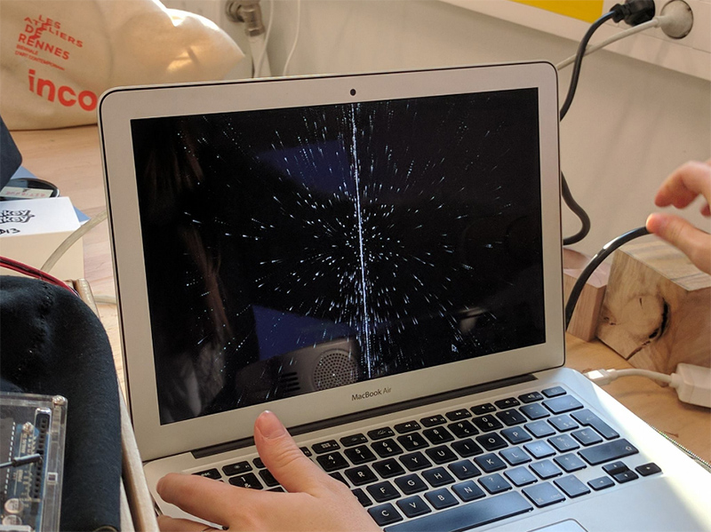
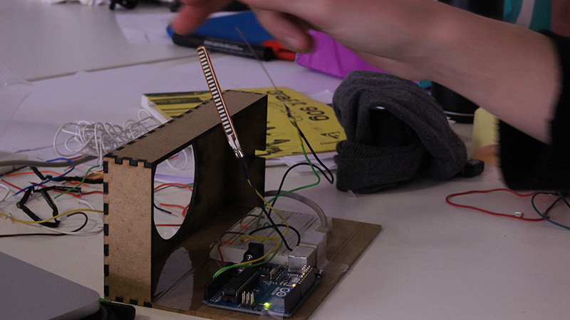
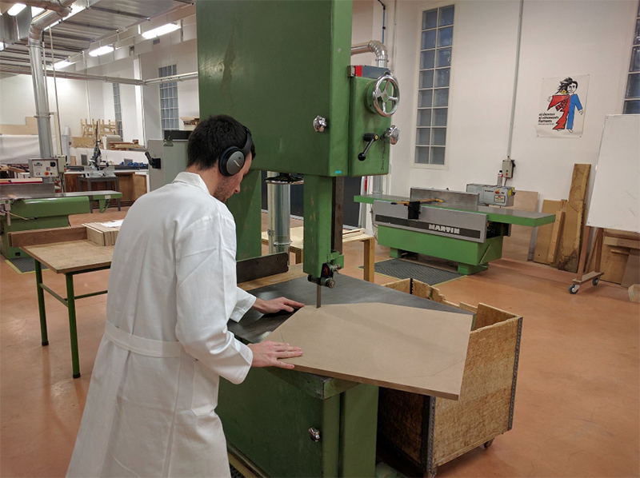
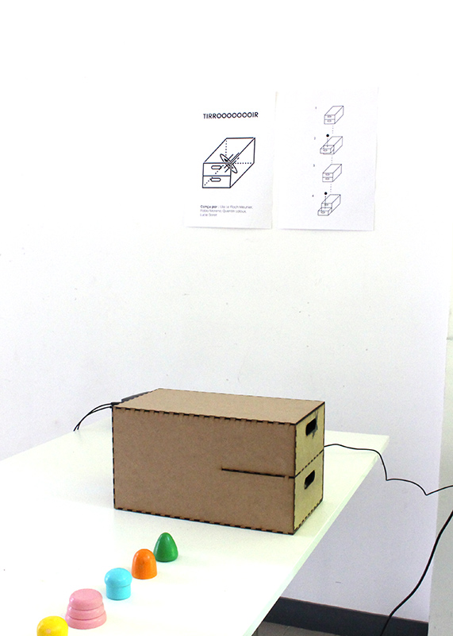
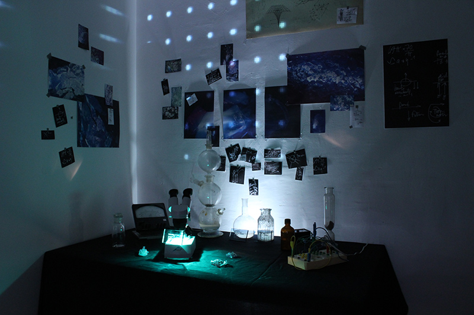
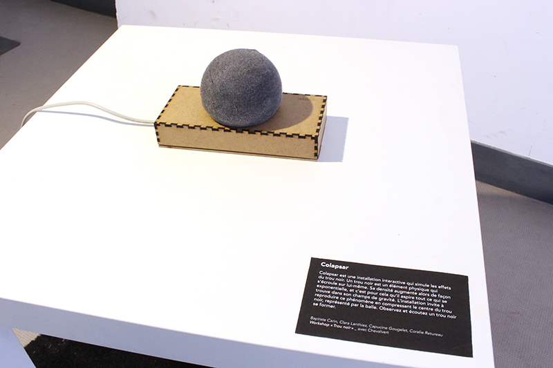
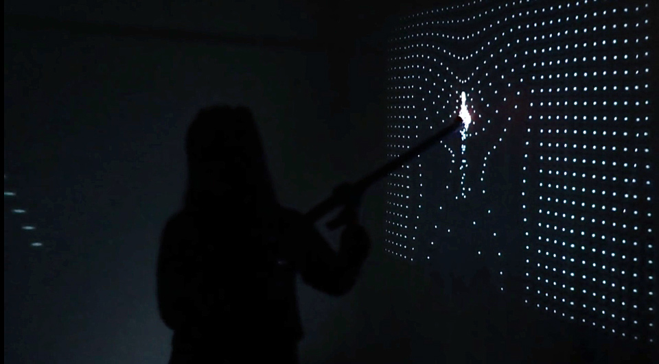
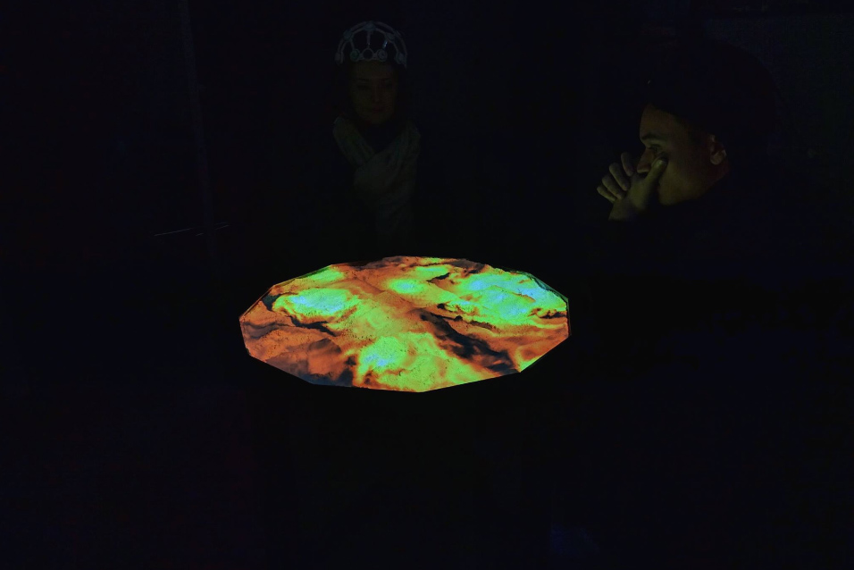

  

# Trou noir — force d’attraction lumineuse

*Workshop conjoint entre les écoles [Boulle](http://www.ecole-boulle.org/) et [Estienne](http://www.ecole-estienne.paris/), mené par [Chevalvert](http://chevalvert.fr/) sur 3 jours*

### Sujet
> Concevoir et réaliser une maquette de l'objet le plus antagoniste à la lumière et symbole de la nuit ultime : le **trou noir**. Les prototypes imaginés devront générer "une force d'attraction visuelle et métaphorique" apte à aspirer la lumière autour d'eux, tout en mettant en scène ses derniers moments.

### Approche
> La lumière pourra être re-matérialisée à la fois comme une particule et une onde, voir même détournée vers un état liquide et fluide au contact du trou noir. Le trou noir, par la gravité qu'il génère en raison de sa masse, permet d'imaginer une rencontre atypique entre les concepts de lumière et de nuit. Les réalisations pourront s'incarner sous la forme de micro-installations basées sur la rencontre entre art et science.

## À propos des trous noirs
###### [Trou noir — Wikipédia](https://fr.wikipedia.org/wiki/Trou_noir)
- Il est **impossible d'observer un trou noir**. On déduit sa présence de son action gravitationnelle.
- Un trou noir ne peut pas être décrit théoriquement, mais peut l'être physiquement. Il ne s'agit pas réellement d'un trou, mais d'une sphère.
- Un trou noir est composé d'une [**singularité gravitationnelle**](https://fr.wikipedia.org/wiki/Singularit%C3%A9_gravitationnelle), et d'un [**horizon**](https://fr.wikipedia.org/wiki/Horizon_(trou_noir)).
- Un trou noir est un objet **simple**, en cela qu'il est décrit par un très petit nombre de paramètres : sa masse, sa charge électrique et son moment cinétique. Par comparaison, la description d'une planète fait intervenir des centaines de paramètres. 

## Références
###### Références scientifiques
- [Trou noir — Wikipédia](https://fr.wikipedia.org/wiki/Trou_noir)
- [Lentille Gravitationnelle — Wikipédia](https://fr.wikipedia.org/wiki/Lentille_gravitationnelle)
- [Anneau d'Einstein — Wikipédia](https://fr.wikipedia.org/wiki/Anneau_d%27Einstein)
- [Satellite Hubble — Instagram](https://www.instagram.com/hubble_space/)
- [*A Sky Full of Ghosts* — Cosmos](https://en.wikipedia.org/wiki/A_Sky_Full_of_Ghosts)

###### Références artistiques
- [*Interstellar* — Scène du Trou Noir](https://www.youtube.com/watch?v=YdSz12Glhlw)
- [*Dark Matter* — Studio Troika](http://troika.uk.com/work/dark-matter-art-basel-unlimited/)
- [*Black Hole Lamp* — Curve ID](http://www.designboom.com/design/curve-id-black-hole-lamp-dario-narvaez-anthony-baxter-11-24-2016/)
- [*Moon Lamp* — Kazuhiro Yamanaka](http://www.designboom.com/design/kazuhiro-yamanaka-collapsible-moon-lamp-11-23-2016/)
- Olafur Eliasson ([website](http://olafureliasson.net/archive/artwork), [instagram](https://www.instagram.com/studioolafureliasson/))
- V::tol (http://vtol.cc/filter/works/division-by-zero)
- Installation sonore : electro aimant + aiguilles + verre (http://www.neloakamatsu.jp/chijikinkutsu-eng.html)

###### (suite)
- A la recherche du Vortex (https://www.youtube.com/watch?v=rcv1IokfS0A)
- Aireal: Interactive Tactile Experiences in Free Air (https://www.disneyresearch.com/project/aireal/)
- Cords UIs (http://tangible.media.mit.edu/project/cord-uis/)
- Data drops (http://www.varvarag.info/data-drops/)
- Noisy Jelly (https://vimeo.com/38796545)
- Alive Painting (http://www.aec.at/radicalatoms/en/alive-painting/)
- Anish Kapoor (https://www.dezeen.com/2016/03/02/anish-kapoor-exclusive-rights-vantablack-blackest-black-pigment/)
- Drench Glow (https://vimeo.com/119439416)
- Ejtech (https://vimeo.com/ejt)
- Ebb Flow (http://www.jasonbruges.com/design/#/ebb-flow/)

## Ressources
###### Matos
- 2 machines à fumée
- 2 kinect
- 1 cadre infrarouge
- kits encre conductrice
- Makey Makey
- Vidéo projecteurs
- Rétro-projecteurs
- Leds, piles, capteurs divers, Arduino, magnets, etc...
- Matériaux divers (mirroirs, tulles, tissus, papier etc...)

###### Code
- [chevalvert/osc-smt-broadcaster](https://github.com/chevalvert/osc-smt-broadcaster)

